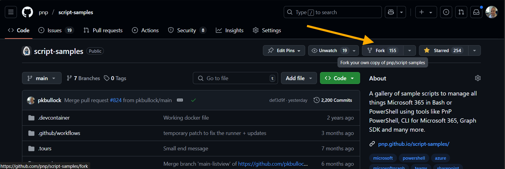

# Submitting Pull Requests

## The process

Here's a high-level process for submitting new samples or updates to existing ones.

 - Step 1 - Signing the CLA (One-time activity)
 - Step 2 - Fork the repository
 - Step 3 - Preparing a submission
 - Step 4 - Create a pull request


 - Step 5 - What happens next, when the sample is submitted


## Step 1 - Signing the CLA (One-time activity)

Before we can accept your pull requests you will be asked to sign electronically Contributor License Agreement (CLA), which is a pre-requisite for any contributions all PnP repositories. This will be one-time process, so for any future contributions you will not be asked to re-sign anything. After the CLA has been signed, our PnP core team members will have a look at your submission for a final verification of the submission. **Please do not delete your development branch until the submission has been closed.**

You can find Microsoft CLA from the following address - https://cla.microsoft.com.

## Step 2 - Fork the repository

In GitHub here: https://github.com/pnp/script-samples

Find the Fork button:



This will make a copy of the site code within your account, this is where you will create the submission.

## Step 3 - Preparing a submission

Please visit this page - [Preparing a submission](preparing-a-submission.md), to see the details of the submission, then return here to continue.

## Step 4 - Create a pull request

Ensure you commit your changes to your fork (copy of the site code)


When you are ready to submit your sample, you will see a 


## Step 5 - What happens next, when the sample is submitted

We will review the submission, make small tweaks if required and provide feedback if needed for anything large. If the submission is approved, we will merge it into the `main` branch and it will be published to the [PnP Script Samples](https://pnp.github.io/script-samples/) site.

Once published, we will begin to promote the sample on social media, see our details on [Recognizing Contributors](recognition.md).

## Other tips

### Want to practice the setup?

If you feel insecure or would struggle to do this and are new to GitHub, please consider to attend the [Sharing Is Caring sessions from the PnP team](https://pnp.github.io/sharing-is-caring/#pnp-sic-events) in which the Microsoft 365 PnP team provides hands-on guidance for first time contributors -these are NOT recorded and completely safe space to ask questions.

### Submission Guidelines

Before you submit your pull request consider the following guidelines:

* Search [GitHub](https://github.com/pnp/script-samples/pulls) for an open or closed Pull Request
  which relates to your submission. You don't want to duplicate effort.
* Make sure you have a link in your local cloned fork to the [pnp/script-samples](https://github.com/pnp/script-samples)

  ```shell
  # check if you have a remote pointing to the Microsoft repo:
  git remote -v

  # if you see a pair of remotes (fetch & pull) that point to https://github.com/pnp/script-samples, you're ok... otherwise you need to add one

  # add a new remote named "upstream" and point to the Microsoft repo
  git remote add upstream https://github.com/pnp/script-samples.git
  ```

* Make your changes in a new git branch:

  ```shell
  git checkout -b working-with-files-in-libraries main
  ```

### Keeping your fork up to date

* Ensure your fork is updated and not behind the upstream **script-samples** repo. Refer to these resources for more information on syncing your repo:
  * [GitHub Help: Syncing a Fork](https://help.github.com/articles/syncing-a-fork/)
  * [Keep Your Forked Git Repo Updated with Changes from the Original Upstream Repo](http://www.andrewconnell.com/blog/keep-your-forked-git-repo-updated-with-changes-from-the-original-upstream-repo)
  * For a quick cheat sheet:

    ```shell
    # assuming you are in the folder of your locally cloned fork....
    git checkout main

    # assuming you have a remote named `upstream` pointing official **script-samples** repo
    git fetch upstream

    # update your local main to be a mirror of what's in the main repo
    git pull --rebase upstream main

    # switch to your branch where you are working, say "working-with-files-in-libraries"
    git checkout working-with-files-in-libraries

    # update your branch to update it's fork point to the current tip of main & put your changes on top of it
    git rebase main
    ```

* Push your branch to GitHub:

  ```shell
  git push origin working-with-files-in-libraries
  ```


